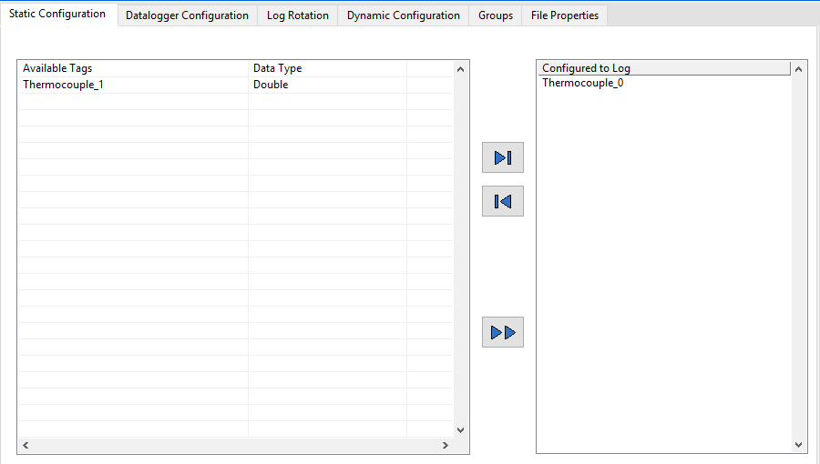
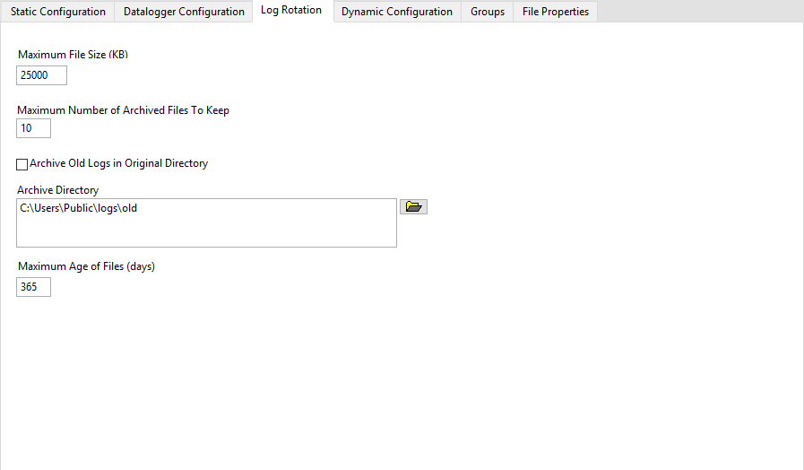

# Overview

The TDMS Logging module may be used to write DCAF tag data to a TDMS file on local disk which provides a useful mechanism to track critical system tags that may be used in monitoring of established applications, commissioning and certification of new deployments, system recovery, and troubleshooting.

The TDMS Logging module enqueues incoming tag data to be consumed by an asynchronous writing process to ensure the DCAF engine is not slowed down by the process of writing to disk.

For additional information on the TDMS file format, read the [TDMS File Format Internal Structure](http://www.ni.com/white-paper/5696/en/) white paper.

# Configuration of the TDMS Logging Module

### Static Configuration

**Available Tags:** Lists all tags within the current engine which are not already in the **Configured to Log** list. The TDMS Module only supports scalar data types so array tags will not be listed.

Move tags into and out of the **Configured to Log** list by selecting individual items and clicking the add and remove buttons. Move all remaining tags into the **Configured to Log** list by clicking the add all button.

**Configured to Log:** A list of all engine tags whose values will be written to TDMS. All data will be written into the TDMS group `tdms writer <UID>` with a unique channel for each data type.

### Datalogger Configuration

**File Name:** Name of the TDMS file which tags will be actively written to.

**Log Directory:** Directory of the active TDMS file.

**Logging File Path:** The fully qualified file path of the active TDMS file. This item cannot be directly edited but instead will be generated based on the values of the **File Name** and **Log Directory** fields.

**Scans Per Write:** The number of engine iterations between writes to the active TDMS file. The module will buffer tag data each engine iteration but will not write the buffered data to disk every iteration as to improve overall system performance.

**Queue Size:** Size of the queue used by the asynchronous writer process to buffer data from the DCAF engine. If **Queue Size** is less than **Scans Per Write**, data will not be logged for every iteration of the engine.

**Approximate Memory Usage:** Calculated size of memory buffer (kB) required to hold the requested number of scans of the specified tags in memory between writes. This value ignores any tags that are dynamically mapped at runtime.

**Use Enable Channel:** Gives user access to the **Enable Tag** within the DCAF engine. If this option is unchecked, the TDMS module will always attempt to write the latest values to disk. If the option is checked, the module will only write to the active TDMS file if the **Enable Tag** value in the DCAF engine is TRUE.

**Enable Tag:** Displays the tag name within the DCAF engine tied to the specific TDMS module's enable property. If **Use Enable Channel** is checked, the TDMS module will only write to disk when the **Enable Tag** is TRUE.

The tag name cannot be edited and will always be `<Module_UID>_FMWK_TDMS_LOGGER_ENABLE`

### Log Rotation

**Maximum File Size:** Maximum file size (kB) of the active TDMS file. The active TDMS log will be renamed and placed in the archive directory and a new TDMS file will be created once active file size exceeds this amount.

**Maximum Number of Archived Files to Keep:** When the amount of TDMS file in the archive directory exceeds this value, the oldest files are deleted until the maximum is no longer exceeded. Archived files receive a sequential identifier appendeded to the name before the file extension (`test.log` archives to `test.1.log`, `test.2.log`, up to `test.<max>.log`). As new archive files are created, the numbers are rotated such that the lowest number is always the most recent file. Files that have a different name pattern are ignored.

>**Note**: TDMS Logging module does not automatically archive existing log files. If a log file in the logging directory has the same name as the configured log file name, the existing file will be overwritten without warning.

**Archive Old Logs in Original Directory:** If checked, archived TDMS files will be saved to the **Log Directory**. If unchecked, archived TDMS files will instead be saved to the **Archive Directory**.

**Archive Directory:** Directory on the local disk to which archived files are moved.

**Maximum Age of Files (days):** Archived files older than the maximum age will be deleted, even if the number of archive files is less than the maximum. Archived files older than the **Maximum Age of files (days)** will only be deleted when the size of the active TDMS file exceeds the **Maximum File Size**.

### Dynamic Configuration

**Enable Dynamic Mapping:** Checking this box enables the TDMS module to automatically log channels whose names match one of the patterns specified in the **Channel Subscription Pattern Matches** input.

**Channel Subscription Pattern Matches:** Use the syntax of the LabVIEW Match Pattern primitive to find matching tags when the module initializes at runtime.

>**Note:** Dynamic configuration attempts to match the names of Input and Processing Parameter channels of any other module within the engine. Channel names and the direction of those channels can be found in the Manual Mapping tab of the Mappings module.

# Classified Errors

The following errors are handled by the TDMS Module's classify errors function.

Error Number | Description | Classification
---|---|---
1 - 10 | Generic file I/O errors. | Critical
11 | Too many files open. | None (ignored by engine)
538400 | A timeout occurred when attempting to move data from the module interface to the background TDMS writer. Try increasing the queue size or reducing the quantity of data to write.  | Recoverable
538401 | The background process aborted for an unknown reason. | Critical

# Software Requirements

+ LabVIEW 2014 or later
